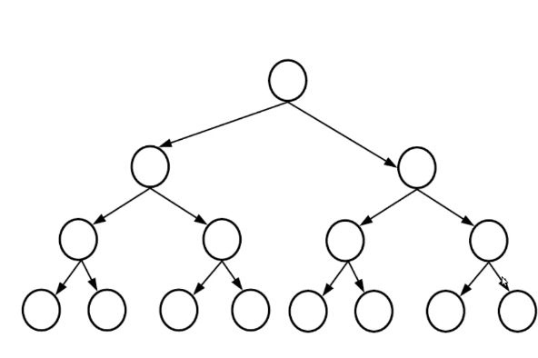

# CppSolvingDataStructuresAssignments

**_I will document some of my DataStructures taken notes here._**

# Trees

- trees are used to store information.
- tree is usually upside down.
- each circle is called a node or a vertex.
- link between 2 nodes is an edge.

- from the above tree, we deduce the following. . .
- the edge is the distance (connection) between 2 nodes, node 5 has no edge with node 4
- [Tree with n nodes has n - 1 edges](https://www.cs.purdue.edu/homes/spa/courses/sa12/mod8.pdf)
- the tree has 4 levels, levels (0,1,2,3)
- Node(1) has 2 children: 2 and 3
- The parent of Node(7) is node(2)
- Nodes {5, 9} are siblings (brothers)
- height (specific to each node) represents the number of edges on the longest downward path between a node(vertex) and a leaf.
- Tree of N levels has N-1 heights, since that the tree above has 4 levels, then the height is 4-1 = 3 edges
- the height of the node 1 (root) is 3 (start from the root to the longest path downward to the farest leaf)
- node 7 has a height = 0
- Node's Depth : the number of edges from the node to the root node.
  **_Difference between Depth and Height_**
  - depth is specific about 2 nodes (root node and the current node only)
  - height is going down from the node to the leaves. (height is about my current node and any other node (leaf) i can reach - longest path)
- there is only 1 path between any 2 nodes. (you are now at the root node and you wanted to go to the node 4, then there is only 1 way (simple tree)
- in a tree where every node has only 1 single parent, then there is only 1 path from a node to another.

**Sub Trees**

- recursive nature where each tree has a subtree and each subtree has another subtree.
- Problem solving tip: we deduce that when we want to get the elements of a tree, we will do this recursively.

# Binary Trees

- a tree where each node at least has at most 2 children (left and right nodes).
- a leaf node is a node with no children.

**this is a simple tree (a node has many children)**

**this is a binary tree (each node has at most 2 children)**

-- A linked List is a special case of a binary tree.

# binary tree traversal 1

traversal is a way of walking through an elements of a data structure.

we need to create an expression tree (leaves are operands and others are operators)

can draw this tree : (2+3)\*4

# types of traversal

- LVR (left, visit, right) --> in order traversal
 
how to know the printed nodes visually ?
 

project down each node and read from left to right, this is how the binary tree is represented visually as shown.

---

- LRV (left, right, visit) --> post order traversal

 --> left first, then right first , then printing the nodes 

 how to deduce the printed nodes visually ? 
 
just in 2 steps : 

**step 1**
for every node , if it doesnot have a right , then project it down, what if it does have a right node? --> wait for it 

**step 2**

for the nodes that have a right node , project it down after its right node.

note that, when projecting the nodes in step 2 , we go from bottom to up level by level.

---

- VLR (visit, left, right) --> preorder traversal

 how to deduce the printed nodes visually ? 

will be the opposite of the post order traversal (2 steps)

**step 1**
for every node , if it doesnot have a left, then project it down, what if it does have a left node? --> wait for it 

**step 2**
then we project the nodes that have a left node before its left subtrees 

- note that, when projecting the nodes in step 2 , we go from bottom to up level by level.

---

# Full / strict binary trees

- it's a tree where each node has 0 or 2 children.

## what is an internal node in a full binary tree ? 
- it's a non leaf node (a node with 1+ child) , in a full binary tree , leaf nodes  = internal nodes + 1 

## given height , how to deduce the min number of nodes in a full binary tree ?
- min # no. of nodes = 2 * h + 1  

# perfect binary trees is satisfied with 2 conditions  
**1st**
- all leaf nodes have the same level. 
**2st**
- all other nodes (internal nodes) have 2 children.

## what is a complete level ? 
- it is a level where all possible nodes exist.
 

- 4 levels but its maximum number of edges is 3 (height is 3). 

---

  <h3>⚠️ Heads Up!</h3>
  
<strong>This ReadMe is under constant updates.</strong>

  
Stay tuned for new notes, revisions, and insights as I continue building this repository. 📚💡

---

# Acknowledgments

> Thanks to Dr.Moustafa Saad, Nidal Fikri
